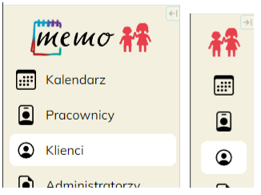
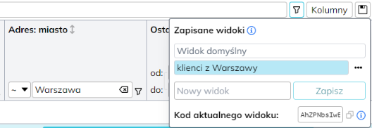

## $t(app_name) $t(app_version.v)0.17 {#v0.17}

Data wydania: **26 stycznia 2025**

🟢Składany pasek nawigacji. Na górze po prawej stronie paska nawigacji pojawiła się mała strzałka
służąca do przełączania między pełnym widokiem a wąską wersją.

🟢Drobne poprawki w widoku aplikacji na telefonach komórkowych: dół aplikacji nie powinien już być obcięty,
trochę lepsze wsparcie nawigacji dotykowej, no i możliwość złożenia paska nawigacji.

Uwaga: nadal Memo nie jest zasadniczo przystosowane do przeglądania na telefonie komórkowym,
ale do drobnych zadań (np. sprawdzenie kalendarza) telefon może być wystarczający — mobilna wersja
przeglądarki Chrome działa. Najlepiej włączyć w ustawieniach _Widok na komputer_.

🟢Kiedy otwarty jest profil klienta, tytuł okna przeglądarki zawiera jego imię i nazwisko.
Pomaga to znaleźć odpowiednią kartę przeglądarki gdy otwarte jest wiele profili.

🟢Zapisywanie widoków tabeli (funkcja nieco bardziej zaawansowana).

Tabela klientów i tabele raportów (a także niektóre inne) mają teraz możliwość zapisania określonego widoku,
czyli zestawu widocznych kolumn, filtrów i sortowania. Przykład użycia: jeżeli pracownik przegląda np.
listę klientów filtrując tylko klientów z Warszawy, posortowaną po liczbie odbytych spotkań,
to może otworzyć panel zapisanych widoków (ikona dyskietki na górze po prawej stronie),
wpisać nazwę i zapisać ten widok, a następnie szybko go przywołać w przyszłości. Zapisać można
wiele widoków i wygodnie się między nimi przełączać.

Jest to jeszcze bardziej pożyteczne na tabelach raportów, gdzie niektóre filtry mogą być dość skomplikowane,
i ustawiając je ręcznie łatwo zapomnieć np. o filtrowaniu również statusu spotkania.

Dodatkowo pole _Kod aktualnego widoku_ pozwala na skopiowanie wartości (uwaga, jest dość długa,
wyświetla się tylko kawałek) i przekazanie jej innemu pracownikowi, np. na komunikatorze.
Drugi pracownik musi otworzyć tę samą tabelę i wkleić otrzymają wartość w to samo pole aby przywołać ten sam widok.

🟣Dla administratora placówki: W tabeli pracowników można sprawdzić datę i godzinę ostatniego
logowania pracownika, a także informację kiedy ostatnio zmienił hasło.

🔴Administrator globalny może aktywować/dezaktywować pracownika placówki (niestety nadal nie może tego
drobić administrator placówki). Dodatkowo nieaktywny pracownik placówki jest w niej widoczny,
ale nie może się już do niej logować.

⚫Dużo różnych drobnych widocznych i niewidocznych poprawek i optymalizacji.
