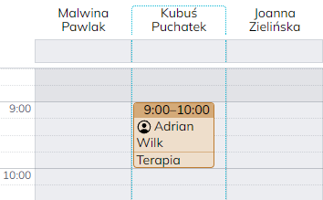
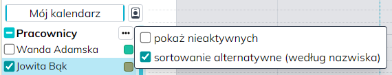

## $t(app_name) $t(app_version.v)0.18 {#v0.18}

Data wydania: **24 lutego 2025**

`🟢` Eksport danych pojedynczego klienta do pliku CSV — służy do tego nowy przycisk obok przycisku edycji klienta.

`🟢` Formularz logowania do Memo zapamiętuje teraz adres email, przy kolejnym logowaniu wystarczy wpisać hasło.

`🟢` W widoku dziennym kalendarza kolumna należąca do aktualnie zalogowanego pracownika jest wyróżniona,
przez co łatwiej jest znaleźć w kalendarzu własne spotkania albo dodać spotkanie we własnej kolumnie.

`🟢` Nowa opcja sortowania pracowników w kalendarzu według nazwiska zamiast według imienia. Aby włączyć tę opcję,
należy użyć przycisku z trzema kropkami w nagłówku "Pracownicy" po lewej stronie kalendarza.

`🟢` Uzupełniono i rozszerzono niektóre strony pomocy.
