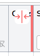
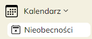
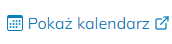
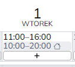
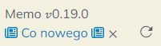

## $t(app_name) $t(app_version.v)0.19 {#v0.19}

Data wydania: **$$$DATE$$$**

🟢Kolumnę tabeli można teraz ukryć zmniejszając jej szerokość do zera. Chwyć myszą granicę kolumn i przeciągnij
ją w lewo aż stanie się czerwona, a następnie upuść.

🟢Dodano stronę _Nieobecności_, na której można zobaczyć urlopy i zwolnienia wszystkich pracowników
na jednym widoku. (Uwaga: nie ma obecnie możliwości wpisania nieobecności administratorów, którzy
nie posiadają własnego kalendarza.)

🟢Na stronie pracownika dodano link, dzięki któremu można szybko przejść do jego kalendarza.

🟣Administratorzy placówek: Przy edycji istniejącego elementu grafiku pracy należy wybrać go w górnej
części kalendarza (pokazanym na obrazku). Dotąd działało również wybieranie elementów z obszaru godzinowego,
ale zostało to zmienione.

🟤Informacje _Co nowego w Memo_ są teraz dostępne w dokumentacji, na stronie, którą właśnie oglądasz.
Po wydaniu nowej wersji Memo w lewym dolnym narożniku pojawi się link do aktualności.

🟤Dokumentacja: Dodano tabelkę wyjaśniającą [uprawnienia pracownika](staff-roles#permissions-table).

⚫Zaimplementowano kilka dodatkowych mechanizmów zwiększających bezpieczeństwo aplikacji i jej odporność
na ewentualne ataki, m.in. skonfigurowano
[CSP (Content Security Policy)](https://developer.mozilla.org/en-US/docs/Web/HTTP/Guides/CSP) oraz dodano
ochronę przed
[CSRF (Cross-site request forgery)](https://developer.mozilla.org/en-US/docs/Web/Security/Practical_implementation_guides/CSRF_prevention).

<!-- $$$DELETE_FROM_HERE_WHEN_FINAL$$$, $$$ADD_LOG_ABOVE_SINCE_COMMIT$$$ 7c53ad7ebb05350fcb471d8ff61b833504ce06c3 -->
---
…

🟢 — dla wszystkich,
🟣 — dla administratorów placówki,
🔴 — dla administratorów globalnych,
🟤 — dokumentacja,
⚫ — inne.
