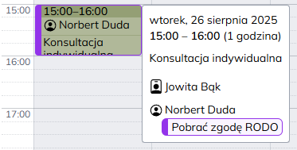

## $t(app_name) $t(app_version.v)0.21 {#v0.21}

Data wydania: **$$$DATE$$$**

`🟣` Dodano informacje o spotkaniach do tabeli powiadomień, oraz informacje o powiadomieniach do raportów spotkań.

`🟢` Dodano [$t(models.client.urgentNotes)](client-urgent-notes) — możliwość ustawienia dla klienta notatki widocznej przy
każdym jego spotkaniu w kalendarzu.

<!-- $$$DELETE_FROM_HERE_WHEN_FINAL$$$, $$$ADD_LOG_ABOVE_SINCE_COMMIT$$$ f467de52a16d0661ef69055f6616b67344def02e -->

---

…

`🟢` — dla wszystkich,
`🟣` — dla administratorów placówki,
`🔴` — dla administratorów globalnych,
`🟤` — dokumentacja,
`🟡` — bezpieczeństwo,
`🟠` `🔵` `⚪` `⚫` — inne.
